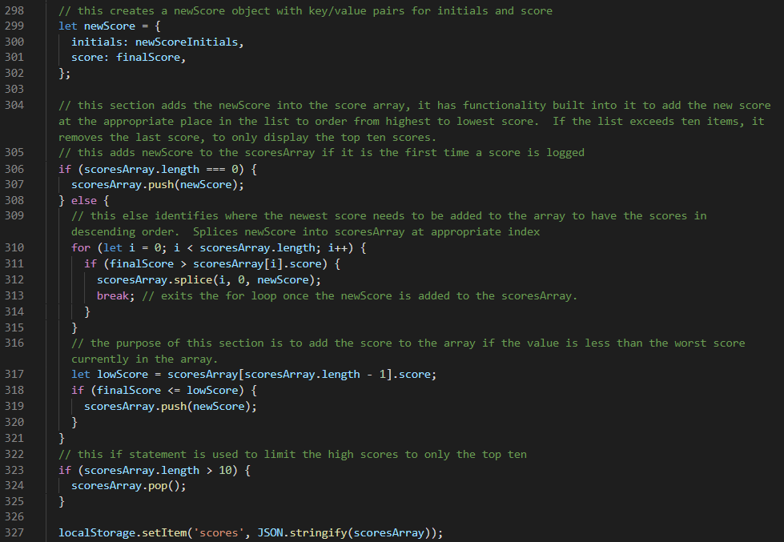
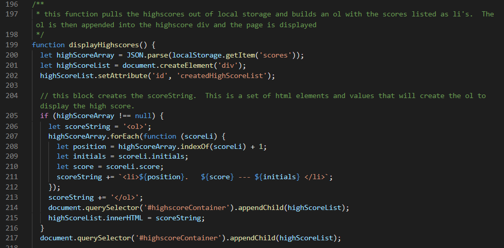

# Code Quiz

## Purpose and Functionality

This site provides the user with a quiz on coding concepts. The quiz is timed and upon completing the quiz the user is able to save their score to a high score list. The high score list is saved in Local Storage to allow the list to persist across page loads. The high score list is able to be cleared by using a button on the user interface.

## Key Learnings

- Use of Web API to dynamically display content.
  - Adding event listeners for clicks at various elements
  - Use of HTML forms to gather user inputs
    - Validation on forms to ensure that only acceptable inputs are provided by the user
  - Use of setInterval to execute functions on a predefined frequency
  - Use of preventDefault to override browser default handling for certain events (i.e. form submission)
- Animation creation in CSS
  - generation of custom animations
  - adding animations dynamically using Web API
- Use of local storage for tracking data across page refreshes
  - high score list is an array. It is stored in and retrieved from localStorage using JSON.

## Deployed Site

The deployed site is hosted on github pages at the following link:

https://aavillanueva6.github.io/codeQuiz/

## Screenshots

- The first image is a section of the JavaScript file. It shows the algorithm that is used to sort the high scores.
- The second image is a section of the JavaScript file. It shows the algorith that builds the highscore list as a series of \<li>'s inside of an \<ol>. It then appends the entire list inside of a previously defined \
.
- The third image is a gif of a demo of the application.

### Image 1 - high score list sorting algorithm

### Image 2 - high score list building algorithm

### Application Demo

## Known Bugs

- None

## Potential future improvements

- Use targets for the button clicks instead of adding listeners for each button individually.
- Dynamically build buttons for answers, instead of hard coding them in the html.
  - This would make it possible to add functionality to display different numbers of answers based on the question that is displayed (true/false vs 4 x multiple choice)
